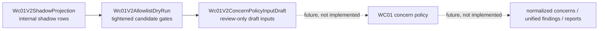

# WC01 v2 Policy Owner Review Packet

Internal review packet only. Not customer-facing report output.

## Executive Summary

We built a dry-run-only WC01 v2 concern-policy input draft stage. It converts already-gated `Wc01V2AllowlistDryRun` candidates into internal `Wc01V2ConcernPolicyInputDraft` artifacts so policy owners can review whether the proposed input contract is the right shape for a future WC01 concern-policy implementation.

The current internal-only pipeline is:

```text
Wc01V2ShadowProjection
-> Wc01V2AllowlistDryRun
-> Wc01V2ConcernPolicyInputDraft
```

This stage does not create persisted normalized concerns, unified findings, checklist rows, executive rows, top findings, scoring, regulatory lenses, customer-facing copy, or production report output.

The stage is dry-run-only because the policy contract, evidence requirements, copy posture, and production gates have not been approved. The output is intended to help reviewers decide what should be allowed into future concern policy, not to make customer-facing determinations.

Latest cohort results:

| Cohort | Sites processed | Concern input drafts |
|---|---:|---:|
| Expanded | 10/10 | 11 |
| Stress | 12/12 | 11 |
| Edge | 30/30 | 34 |
| Total | 52/52 | 56 |

Guardrail results:

| Guardrail | Result |
|---|---:|
| Guardrail failures | 0 |
| Malformed artifacts | 0 |
| Forbidden gap status token matches | 0 |
| Raw blocked field matches | 0 |
| Forbidden legal-style term matches | 0 |

## Pipeline Diagram



The dashed path is not implemented and should not be implemented until policy review is complete.

## Policy-Stress Cohort Validation

The policy-stress cohort was added to test conservative behavior in policy-sensitive contexts before policy-owner review. It includes health and medical information, reproductive health, finance, public benefits, children or education, employment or HR, privacy-mature SaaS, CMP-heavy/global surfaces, and behavioral analytics reference sites.

This cohort matters because the same runtime signal can carry different product and policy risk in sensitive contexts. The validation does not approve production use. It checks whether the dry-run pipeline remains narrow, evidence-gated, and internal-only when applied to higher-stakes sites.

Summary:

| Metric | Count |
|---|---:|
| URLs | 20 |
| Site-level completed scans | 20 |
| Site-level failed scans | 0 |
| Partial / module-limited sites | 1 |
| Allowlist candidates | 25 |
| Concern input drafts | 25 |
| WC01 shadow guardrail failures | 0 |
| Sanitizer warnings | 0 |

`fidelity.com` was the one module-limited site: `preConsentRuntimeScanner` and `consentFlowRuntimeScanner` failed, and the output correctly carried through as coverage-limited / zero-candidate rather than being hidden or promoted.

Candidate families:

| Draft family | Count |
|---|---:|
| `pre_consent_tracking` | 11 |
| `pre_consent_cookie_storage` | 10 |
| `session_replay_behavioral_analytics` | 4 |

Sensitive-context sites with internal review-only draft inputs:

- `healthline.com`
- `plannedparenthood.org`
- `bedsider.org`
- `bankofamerica.com`
- `benefits.gov`
- `ssa.gov`
- `pbskids.org`
- `greenhouse.com`
- `workday.com`
- `cloudflare.com`
- `hotjar.com`

Sites with zero concern input drafts:

- `bbc.com`
- `fidelity.com`
- `healthcare.gov`
- `indeed.com`
- `khanacademy.org`
- `mayoclinic.org`
- `proton.me`
- `statefarm.com`
- `webmd.com`

Sensitive-context note: these rows are internal review-only draft inputs. They are not customer-facing findings, legal conclusions, production report output, checklist rows, executive rows, top findings, persisted normalized concerns, or unified findings.

Gate validation:

| Gate check | Result |
|---|---:|
| `tag_management` supporting count | 0 |
| `consent_management` supporting count | 0 |
| Tier B/C leakage | 0 |
| Surprise candidates | 0 |
| Candidates from `third_party_vendors_observed` | 0 |
| Candidates missing source refs | 0 |
| Candidates missing excerpts / display-safe evidence | 0 |
| Candidates with weak/missing confidence or directness | 0 |
| Downstream `gap_observed` token matches | 0 |
| Raw blocked field matches | 0 |
| Forbidden legal-style term matches | 0 |
| WC01 shadow guardrail failures | 0 |
| Sanitizer warnings | 0 |

Policy implications: before any future customer-facing use, policy owners should consider whether sensitive-context sites require policy-surface coverage, an explicit coverage-limitation posture, stricter copy review, and stricter evidence requirements. This is especially important for health, reproductive health, children/education, public benefits, employment/HR, and behavioral analytics contexts.

## Draft Families Under Review

### `pre_consent_tracking`

Represents: runtime evidence that a tracker-like vendor or collection endpoint was observed before a consent action, after the allowlist dry-run gates accepted the row as a review-only candidate.

Does not prove: that a legal violation occurred, that user consent was legally required, that the site intended tracking, or that all relevant consent and disclosure context has been evaluated.

Why review-only: the row is based on internal runtime observation and attribution gates, but WC01 policy has not approved how this should become a normalized concern, checklist row, report finding, or customer-facing statement.

Possible future WC01 concern target: a narrowly scoped pre-consent tracking concern that requires retained runtime evidence, vendor purpose support, source refs, display-safe excerpts, confidence/directness gates, and policy-approved copy.

Policy questions:

- Which vendor purposes should support this family?
- Should analytics and advertising be handled together or split?
- What directness and confidence thresholds are required?
- What disclosures or consent-path evidence must be reviewed before any production use?
- Should this ever be customer-facing, or should it remain an internal reviewer workflow?

### `pre_consent_cookie_storage`

Represents: runtime evidence that third-party cookie/storage behavior was observed before a consent action, after the allowlist dry-run gates accepted the row as a review-only candidate.

Does not prove: that stored data is personal data, that the storage is unlawful, that the cookie is unnecessary, or that the site failed a legal requirement.

Why review-only: cookie/storage evidence needs careful policy treatment around first-party vs. third-party context, functional vs. tracking purposes, consent state, and display-safe evidence requirements.

Possible future WC01 concern target: a third-party pre-consent storage concern that remains separate from broader pre-consent tracking unless policy owners approve merging them.

Policy questions:

- Should pre-consent tracking and third-party pre-consent storage remain separate families?
- What party/context evidence is required to distinguish first-party, third-party, CMP, security, and functional storage?
- Should CMP/security/necessary cookies be excluded by default?
- What source refs and excerpts are required before customer-facing use?
- Should this family require corroborating policy-surface evidence?

### `session_replay_behavioral_analytics`

Represents: runtime evidence associated with session replay or behavioral analytics vendors, currently only when the allowlist dry-run accepts the row as a review-only candidate.

Does not prove: that a replay recording occurred, that sensitive fields were captured, that the session was tied to an identified person, or that the use violates any law or policy.

Why review-only: library presence alone can be misleading, and production treatment should require stronger evidence of collection behavior and policy-approved copy.

Possible future WC01 concern target: a behavioral analytics/session replay concern that requires collection endpoint evidence or equivalent strong runtime support, not library-only evidence.

Policy questions:

- Should session replay require collection endpoint evidence, not library-only evidence?
- Are behavioral analytics and full session replay the same concern family or separate families?
- What evidence is needed to avoid overstatement?
- Should sensitive-field capture be a separate concern requiring stronger evidence?
- Should this family be limited to internal reviewer workflows only?

## Excluded Families

These rows are not entering concern-policy draft inputs yet:

| Excluded family or purpose | Reason for exclusion |
|---|---|
| `third_party_vendors_observed` | Inventory-only context. Vendor presence alone is not enough to draft a concern-policy input. |
| `consent_banner_observed_or_not_observed` | Banner presence/absence is context, not a standalone draft concern input. |
| Unresolved endpoint review | Attribution is incomplete; unresolved endpoint rows remain conservative review signals only. |
| Policy/runtime alignment | Alignment and mismatch checks remain conservative review signals until policy approves stronger gates. |
| Consent-flow deltas / persistence rows | Deltas can be useful diagnostics, but are not production concern inputs without stronger action-outcome and evidence rules. |
| Tier C purposes: security, performance, support, infrastructure, fraud/bot, RUM, live-chat | These purposes are non-tracker by default and block candidates when mixed until evidence-subset gates exist. |
| `tag_management` / `consent_management` | Diagnostic metadata only. These purposes do not support draft concern inputs on their own. |

## Guardrails

Hard guardrails currently enforced or preserved by the draft stage:

- No `gap_observed` output.
- No legal-conclusion language.
- No production eligibility.
- No top-finding eligibility.
- No gap eligibility.
- No raw blocked fields.
- No persisted normalized concerns.
- No unified findings.
- No report, checklist, executive, scoring, regulatory-lens, or customer-facing integration.

## Review Questions For Policy Owner

- Are these three draft families the right initial scope?
- Should `pre_consent_tracking` and third-party pre-consent storage remain separate?
- Should session replay require collection endpoint evidence, not library-only evidence?
- Should `tag_management` always remain diagnostic-only?
- Should `consent_management` always remain diagnostic-only?
- Should mixed Tier C diagnostic purposes always block until evidence-subset gates exist?
- Which vendor purposes should be allowed to support each draft family?
- What confidence and directness levels are required before any future production use?
- What copy language is acceptable for review-only findings?
- What evidence fields are required before anything can appear in customer-facing reports?
- Should any family be limited to internal reviewer workflows only?
- Should policy/runtime corroboration be required, optional, or separate from runtime-only evidence?

## Decision Table

| Draft family | Approve for next dry-run stage | Needs tighter gate | Keep internal only | Reject for production | Notes |
|---|---|---|---|---|---|
| `pre_consent_tracking` |  |  |  |  |  |
| `pre_consent_cookie_storage` |  |  |  |  |  |
| `session_replay_behavioral_analytics` |  |  |  |  |  |

## Recommended Next Technical Step After Approval

Recommended next step: policy-approved concern-policy-input contract refinement.

This should happen only after policy owners approve the draft families, allowed evidence shape, required gates, and review-only copy posture. No production integration should happen until policy review is complete.

## Explicit Non-goals

- No production integration.
- No customer-facing output.
- No legal conclusions.
- No persisted normalized concerns.
- No unified findings.
- No checklist, report, executive, top-finding, scoring, or regulatory-lens integration.
